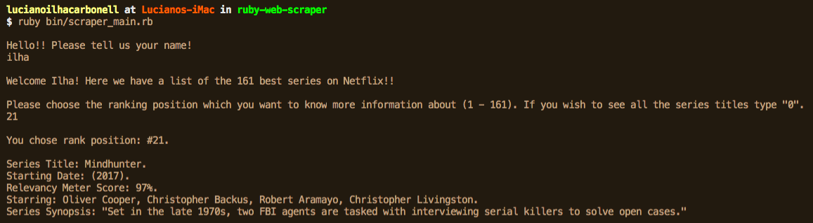

<h3 align="center">Ruby Netflix Series Scraper</h3>

<div align="center">

[]()
[](https://github.com/luciano-ilha/ruby-web-scraper/issues)
[](https://github.com/luciano-ilha/ruby-web-scraper/pulls)
[](/LICENSE)

</div>

---

## 📝 Content

<p align="center">
<a href="#about">About</a>&nbsp;&nbsp;&nbsp;|&nbsp;&nbsp;&nbsp;
<a href="#installing">Installing</a>&nbsp;&nbsp;&nbsp;|&nbsp;&nbsp;&nbsp;
<a href="#built_using">Built with</a>&nbsp;&nbsp;&nbsp;|&nbsp;&nbsp;&nbsp;
<a href="#authors">Authors</a>
</p>

## 🧐 About <a name = "about"></a>

This project is a simple Netflix Series Scraper. Contains information about 161 Netflix series arranged in a ranking based on the relevance of each. First, it asks the user's name, then asks to enter a number from 1 to 161, depending on the user's choice, return the information of the ranking position, title of the series, year of release, relevance meter, main actors and finally the synopsis from the series. If zero (0) is chosen, the whole series list is shown.



## 🔧 Built with<a name = "built_using"></a>

- [Ruby](https://www.ruby-lang.org/);

### 🛠 Installing <a name = "installing"></a>

Clone and run this repository by running these commands on the terminal:

```
- git clone https://github.com/luciano-ilha/ruby-web-scraper;
- cd bin/
- Run ruby scraper_main.rb
```

## How do use Netflix Series Scraper

- First type your name.
- Choose a number between 1 and 161.
- Choose zero (0) to se the whole series list.

## ✒️ Authors <a name = "author"></a>

👤 **Luciano Ilha**

- Github: [@luciano-ilha](https://github.com/luciano-ilha)
- Twitter: [@CarbonellIlha](https://twitter.com/CarbonellIlha)
- Linkedin: [Luciano Ilha Carbonell](https://www.linkedin.com/in/luciano-ilha-carbonell-188115a0/)

## 🤝 Contributing

Contributions, issues and feature requests are welcome!

Feel free to check the [issues page](https://github.com/luciano-ilha/ruby-web-scraper/issues).

## 👍 Show your support

Give a ⭐️ if you like this project!

## 📝 Acknowledgements

- Microverse and The Odin Project

## 📝 License

This project is free to use as learning purposes. For any external content (e.g. logo, images, ...), please contact the proper author and check their license of use.
